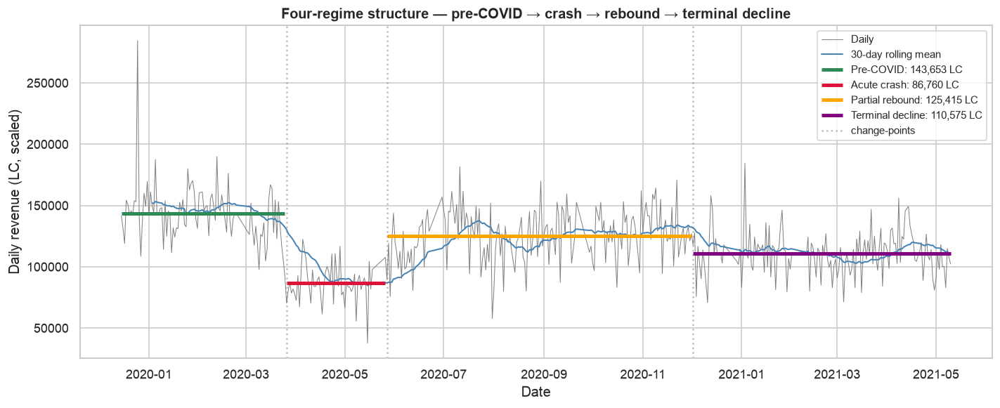
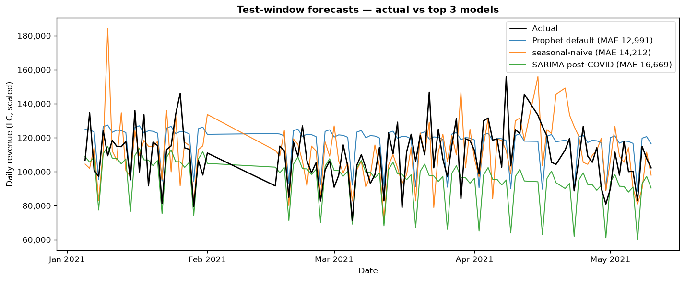

# Pharmacy Revenue Analytics through the COVID Period

After 22 years of running my own community pharmacy, I thought I understood how COVID had reshaped my numbers. My prior was a simple two-stage story: pre-COVID, then post-COVID. The data disagreed.

This project analyses 17 months of my own daily revenue through the pandemic period. It quantifies the shock as a multi-dimensional regime change, tests structural calendar effects, and benchmarks seven candidate forecasting models against a 130-day out-of-sample horizon.



> **Data notice.** The values in this dataset are real observed daily sales multiplied by a single constant scaling factor for privacy. All statistical properties (patterns, breaks, tests, coefficients, p-values) are identical to those computed on the raw data. Reported units are **LC** (local currency, scaled). Weekday labels: **BD1–BD5** for business days, **WE1–WE2** for weekend days, ordered by business week.

## Data

Daily revenue exports from the pharmacy's management software. Coverage runs from 2019-12-15 to 2021-05-10 (513 calendar days, 470 with data). Daily total revenue only — no SKU or basket detail. The shipped CSV has two columns: `date`, `revenue_scaled`. The unscaled column stays local and is gitignored.

## Method

Five notebooks, one hypothesis family per notebook.

| Notebook | Hypothesis | Method |
|---|---|---|
| `01_eda` | Descriptive baseline | Coverage, distribution, rolling means, day-of-week, month-phase |
| `02_change_points` | H1, H2 | Chow test + sup-Wald + PELT, triangulated |
| `03_volatility` | H3 | Levene's + F-test, pooled and per-regime, Bonferroni-corrected |
| `04_calendar_effects` | H4 | OLS with HAC(7), Wald test on coefficient equality |
| `05_forecast` | — | 2 SARIMA variants, 3 Prophet variants, 2 baselines |

## Findings

**H1 — Did COVID cause a level break?** Yes. The Chow test at the a priori candidate date (2020-03-23) gives a shift of -30,994 LC (-21.4%), t = -11.6, p ≈ 1.8e-27. The sup-Wald scan across Feb-Apr 2020 lands on the same date. PELT locates its single break at 2020-03-06 — 17 days before the a priori date, within the same March 2020 regime-change window. Three methods agree.

**H2 — Does the pandemic regime persist?** Yes, with more structure than expected. The terminal-period mean (Feb-May 2021) sits 26% below the pre-COVID baseline (Dec 2019 - Feb 2020). Running PELT on the post-COVID subseries identifies four distinct regimes: pre-COVID (143.7k), acute crash (86.8k, -40%), partial rebound (125.4k, -13%), and terminal decline (110.6k, -23% vs the PELT pre-COVID mean, which is a slightly wider window than the Dec-Feb baseline above). Pairwise Welch's t-tests reject equality between adjacent regimes at p < 1e-10.

**H3 — Did variance change?** Not in the direction I predicted. My prior was that variance would rise post-COVID. The data says it fell. Pooled Levene's fails to reject equal variances (p = 0.134), but this masks real structure: the pooled variance is inflated by between-regime mean differences. Within each post-COVID regime, variance ratios versus pre-COVID are 0.42, 0.79, and 0.56. The direction is consistent across all three regimes but doesn't clear Bonferroni-corrected significance, which reflects Levene's deliberately conservative design against non-normal data.

**H4a — Weekend depression?** Yes at the coarse level: weekend coefficient -8.9%, HAC z = -8.14. Splitting the two weekend days changes the picture: the entire depression sits on WE1 (-19%, z = -15.11). WE2 is statistically indistinguishable from a business day (+1.1%, p = 0.37). The Wald test on WE1 = WE2 rejects with F = 205.7. R² rises from 0.26 to 0.35 once the asymmetry is added.

**H4b — Payday cycle?** The textbook prior fails: the `payday_window` coefficient is -1.4% (wrong sign), p = 0.537. There is a specific institutional reason. A public prescription-reimbursement reform was rolled out years before this sample begins, shifting prescription payments from full out-of-pocket to a small copay. That reform decoupled prescription-purchase timing from income timing. Before the reform, I saw a clear payday cycle in the daily receipts; after, it disappeared. The null the data shows is exactly what this mechanism predicts.

## Forecast

130-day out-of-sample horizon (2021-01-01 → 2021-05-10). Fair comparison across all seven models on 109 common non-NaN days.

| Rank | Model | MAE | MAPE | RMSE |
|---|---|---|---|---|
| 1 | Prophet default | 12,991 | 12.46% | 16,018 |
| 2 | Seasonal-naive (lag 7) | 14,212 | 13.07% | 19,201 |
| 3 | SARIMA post-COVID | 16,669 | 14.61% | 20,964 |
| 4 | Last-value (lag 1) | 18,044 | 17.00% | 22,185 |
| 5 | SARIMA full history | 19,299 | 16.97% | 23,698 |
| 6 | Prophet A (COVID break only) | 23,818 | 23.19% | 26,680 |
| 7 | Prophet B (H2 changepoints) | 24,695 | 24.04% | 27,574 |

Prophet with default auto-detected changepoints wins, beating seasonal-naive by 8.6% on MAE and 16.6% on RMSE.

**The counterintuitive result: injecting my own hypothesis-derived changepoints into Prophet made it worse than the naive baselines.** Both Prophet variants I seeded with expert priors — one with the COVID break, one with the four-regime PELT shifts — placed last on every metric. Forcing Prophet to 1 or 3 pre-specified changepoints removes the L1-shrinkage flexibility it uses to fit local structure. On this series, data-driven changepoint detection beat expert-specified ones.



## Limitations

- **Daily-total revenue only.** No SKU or basket-level detail — no scope for product-mix analysis.
- **Single hold-out window.** The winning model's out-of-sample error is the best of seven and therefore a mildly biased estimate. Real production forecasting uses walk-forward evaluation and champion-challenger rotation on rolling windows.
- **Post-reform regime only.** The dataset entirely post-dates the health-insurance reform that killed the historical payday cycle, so no pre-reform comparison is possible.
- **Missing data.** Around 35 non-consecutive days are absent across the training window (export failures, not closures). SARIMA handles these via state-space missing-data; baselines and metrics use `dropna`.

## Reproducibility

```bash
git clone https://github.com/ahkheniche/pharmacy-covid-analysis.git
cd pharmacy-covid-analysis
python -m venv .venv && source .venv/bin/activate
pip install -r requirements.txt
jupyter notebook notebooks/
```

Notebooks execute in order (01 through 05) with no cross-notebook state. Each can also be re-executed independently:

```bash
jupyter nbconvert --execute --to notebook --inplace notebooks/0N_*.ipynb
```

End-to-end runtime is around 15 seconds on a modern laptop (Prophet's Stan model is compiled on first fit, then cached).

---

### About

Abdelhak Kheniche — independent community pharmacy operator for 22 years, currently transitioning to UK-based quantitative research / model risk / data science roles. LinkedIn: [abdelhak-kheniche](https://www.linkedin.com/in/abdelhak-kheniche/).
